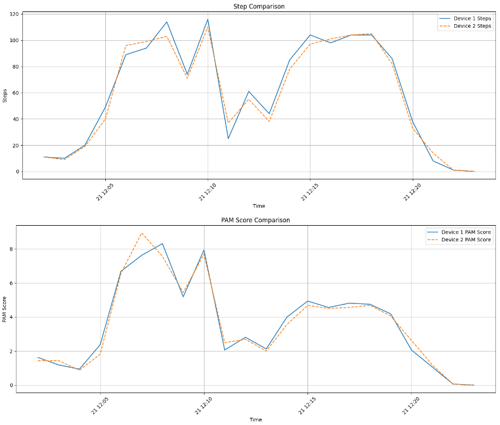
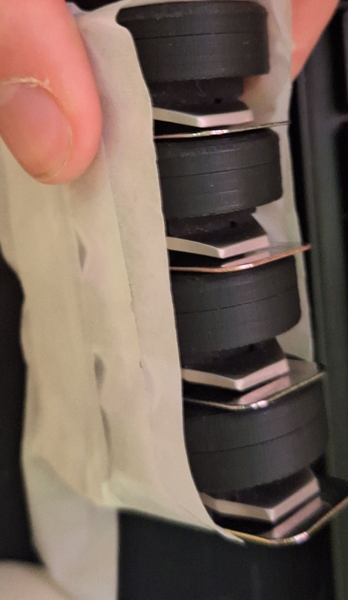
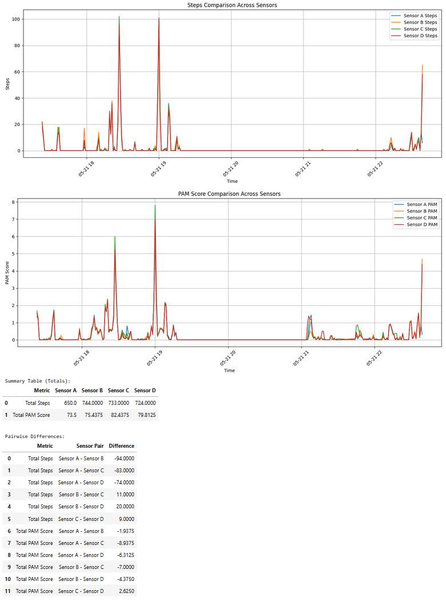

# Old research
For working with the Hipper device, we need to ensure that the data we get from the device is correct data that we can trust. The original developers for the device did some tests and had some problems with wearing 2 devices at the same time and getting different data from these devices. In their research they had a big difference in the PAM score and the amount of steps compared to the 2 devices. This should not happen because both made the same movements at the same time. This is something we have to fix, which is why we need to do this research again. 

## The old research

## New results
These are the results of redoing the research

### Short term tests
We did a small test taping 2 devices together and doing a small walk of around 20–30 minutes. These short term results with our code to pull the data gave us some very good results with not much difference in the results between the 2 devices. These results were mapped out in a [Jupyter file](../../src/back-end/datasets/research/my_notebook.ipynb). The results were as follows:
  
The small differences seen in the PAM scores and steps could be due to the fact that the devices only save the data from entire minutes. These minutes can end at different moments on the devices because they are not reset at the exact same time. This means that there could be small differences. The rest of these results look pretty promising with the results being almost the same. 

### long term tests
Devices reset at ~ 21-5-2025, 17:12. I can't reset all the devices at once as of right now so it was done 1 by 1. After doing this I taped the devices together like this:   
This setup will not work perfectly because the devices are not in the exact same spot, but I did not want to risk the hardware rubbing together and breaking due to static electricity. After doing this I kept the devices on me in the same spot for a couple of hours doing various activities. This started at 17:23 and ended at around 22:40. I have not been moving the entire duration of this experiment, just going about my evening in the way I usually would. The code used to generate these results and the raw data can be found in the gitlab repository under src/back-end/datasets/research. The results of this experiment:

Looking at the results, the steps of this experiment all look very promising and look almost exactly the same, the biggest being between sensor A and B with 94 steps. This difference is not that much over a long period of time and could be due to the fact that the sensors were not worn in the exact same place because they were taped together. There are some spikes in the PAM score in some parts of the experiment, mostly towards the end. This is always when I was doing small movements that were very calm. With these movements we can see a big difference in the data. This could of course be due to the fact that the sensors were not worn in the exact same place so experienced the movement a bit differently, but this would require more testing in a different way than this. The sensors would need to be placed very close to each other and experience the exact same movements to be able to see where this difference comes from.
