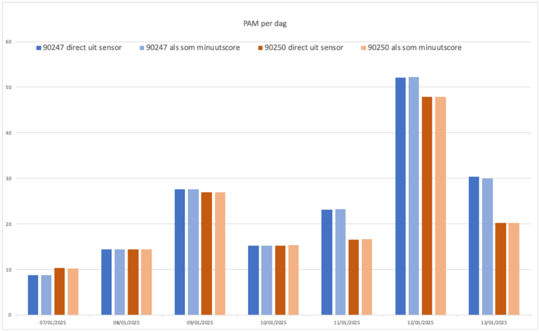

# How Hipper analyzed the devices and data output up until now

First, the research was conducted to investigate the consistency and reliability of the AM500 sensors after concerns were raised by Pieter van Foreest. Two AM500 units (90247 and 90250) were taped together and worn to directly compare output data under identical conditions.

## 🔍 Method of analysis

### Test Setup (Jan 7–13, 2025)

* Two sensors taped together and worn in a pocket.

* Data collected via Hipper box and analyzed on daily and minute-level basis.

### Data Points Used

* PAM (Physical Activity Monitor) score per day (from the sensor and summed from minute values).

* Minute-by-minute activity scores.

* Categorization into low, medium, and high activity.

### Analysis Highlights

* PAM day values from both sources (direct sensor vs. minute score sum) aligned closely.

* Significant differences in values were observed between the two sensors on multiple days.

* Minute score patterns revealed similar peak timings but varied in amplitude.

* Sum of Squared Errors (SSE) used to quantify differences:

  * Jan 10: SSE = 0.27

  * Jan 11: SSE = 0.90

### Activity Level Categorization

* Applied Erik’s threshold values to classify minute-level PAM into activity levels.

* Also tested a broader threshold (e.g., 0.002–0.4) for a simplified Active vs. Inactive classification.

* Simplified classification reduced discrepancies between sensors.

## Second Experiment (Jan 24–30, 2025)

* Sensors were better fixed in their casing.

* Differences between sensors were smaller.

* Sensor 90247 still consistently showed more “low” activity minutes.

🧠 Key Hypotheses for Observed Differences
* Variations in accelerometer accuracy

* Loose sensor mounting

* Differences in sensor sleep/wake cycles