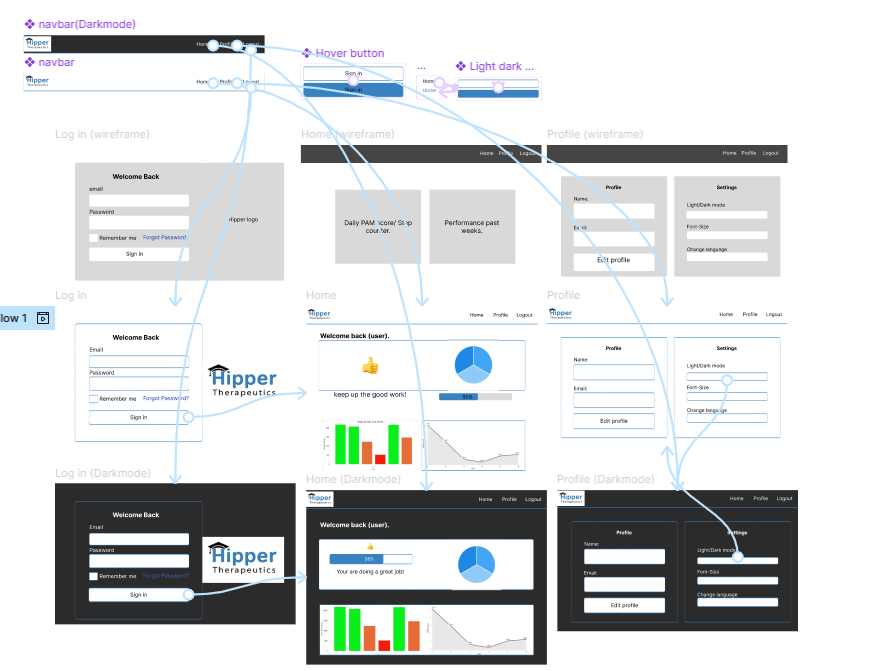
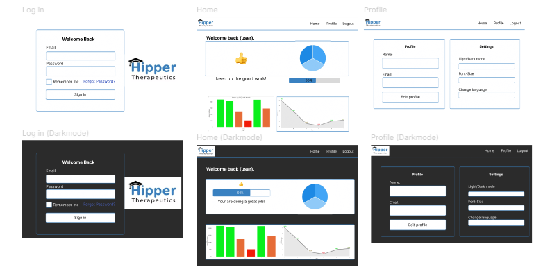
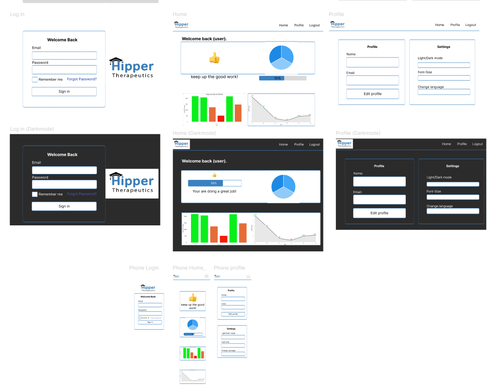
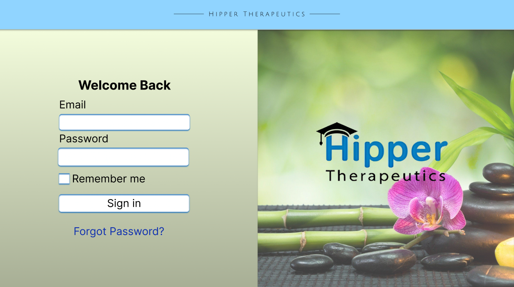
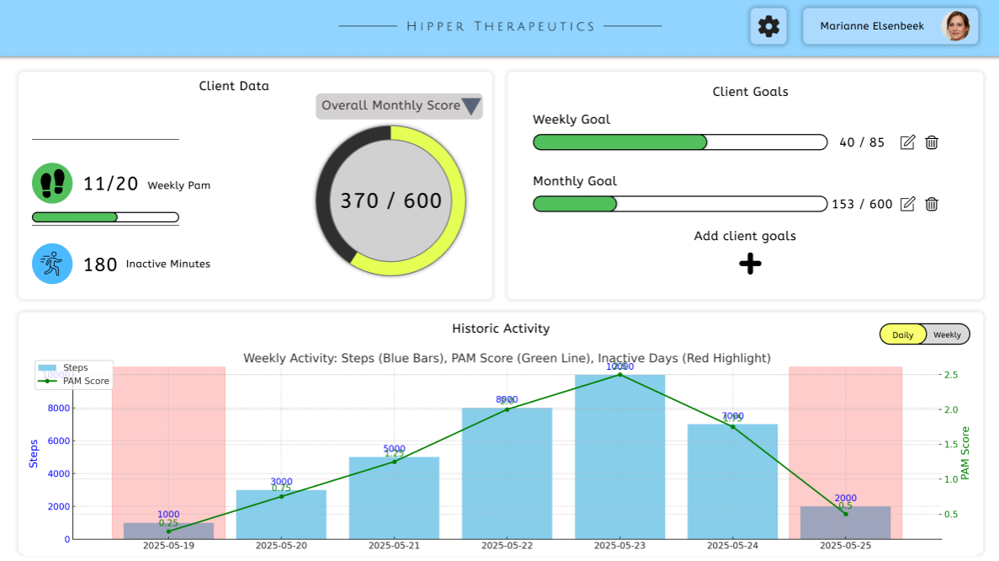

# Figma

## Color Scheme
The chosen color scheme for the app design closely mirrors the colors used on Hipper’s website. This decision was made after discussions with the team, ensuring the app feels like an authentic extension of the Hipper brand. By aligning the app with the website’s color choices, we aimed to create a seamless and legitimate experience that reinforces Hipper's identity.

- The background color: White
- Font color: Black
- The color of the shadow around the boxes: Light blue (color code: 3981C1)

### Dark mode
- Background color: dark grey (color code: 2B2B2B)
- Font color: White (color code: FFFFFF)
- the color of the shadow around the boxes: Light blue (color code: 3981C1)

**References**
- The app used for getting the color code from the website is a macOS app: Digital Color Meter.
- Chatgpt was used to figure out how to use the shadows in figma.

## Navigation Bar
The navbar that is used in the figma design is made into a component, so the it will be reuseable on every page where it is needed. 

### Elements on the navigation bar:

These are to elements used on the navbar:

- The Hipper logo (left-side)
- Shortcuts to Homepage and Profilepage
- Button to log out.

### Steps to make the component:

1. First you have to design the navbar the way you want it to be.

2. Then you need to group all the elements used in the navbar.

3. After this you can right-click the frame and choose create component or Cmd/Ctrl + Alt + K can be used as a shortcut. Now it will be a reuseable component.

### References
- Chatgpt was used to figure out how to make the reuseable component.

## Visual feedback (Hover effect)
To ensure that users testing the Figma prototype are aware of their actions, we have decided to implement a hover effect. When interacting with buttons or elements in the navbar, the user will see a color change upon hovering, providing clear feedback that the element is being used.

**Above is an image of the normal look of the page.**

**Above is an image of the look of the page with the hover effect.**

### Steps to make the hover effect:

1. Create Two States:

- **Normal State:** Design the button or element as it normally looks.
- **Hover State:** Duplicate the normal state and change the color (or add effects like shadow) for when it's hovered over.

2. Set The Hover Interaction:

- Select the **Normal State**.
- Go to the Prototype tab and drag the blue arrow to the **Hover State**.
- Set the trigger to "While Hovering" and the action to "Smart Animate".

3. Preview The Hover Effect:

- Click Present (top-right) to see the effect in action. When you hover, the element should change color.

4. Add Click Interaction:

- If you want the button to navigate, select the **Normal State**, drag the blue arrow to the target frame, and set the trigger to "On Click".

### References
- Chatgpt is used to help figure out the process of making the hover effect for buttons and the navigation bar.
- Also some youtube video's were used to help with understanding how the make the hover effect. (These will be linked below.)

This video is watched at speed 0.25:  [Navigation Hover Effect in one minute using Figma](https://www.youtube.com/watch?v=CnJIfQRur28)

Video on how to create hover effect on button: [Create a Button With a HOVER Functionality in 128 SECONDS (Figma Tutorial)](https://www.youtube.com/watch?v=AHBEpMD2dZ0)

## Dark mode
To switch to dark mode, there is a button under the profile page where settings can be changed. One of these settings is a button to switch between dark and regular themes. 

## Interaction with the prototype
To allow users to experience and test the flow of the app, the Prototype tab in Figma is used to link frames and create interactive elements. By connecting buttons, menus, and other components to their respective screens or actions, designers can simulate real user interactions, enabling more effective testing and feedback during the design process.

### Steps to make interactive prototype

1. Design Your Frames

- Use Frames to represent individual screens.
- Design components (buttons, inputs, images) on each frame.

2. Switch to the Prototype Tab

- Click the Prototype tab in the right-hand panel (next to "Design")

3. Add Interactions

- Select a UI element (like a button).
- You’ll see a circular node (⚪) appear on the right edge.
- Drag this node to the frame you want to navigate to.
- Select the interaction setting you want.

4. Set a Starting Frame

- Click on the frame you want to start at and add Flow starting point.

5. Preview Your Prototype

- Click the Play button at the top-right to open the prototype in presentation mode.

### References
- Chatgpt was used to figure out the process with the starting flow.

## Layout of the application
To make sure that user with or without experience using applications like this can understand how this works. We decided to make the layout of the application as simple as possible, so users will easily understand how to use the application and where they can find the key information they need. 

### Design choices made for the application

1. The colors used in the design are the colors used for the official Hipper website. This was decided after talking with the product owner and the team about it.

2. The homepage is used to display personal information in graphs, so patients can see their progress.

3. On the profile, there are different settings such as dark mode, larger font size, and the option to change the site’s language, allowing users to customize their experience according to their preferences.

4. The design was made as simple as possible to make the application easy to use.

### Feedback from product owner
- The design is boring. Try to make more fun and more engaging to use.
- Look into how the data should be visualized (From the user point of view), so it's easy to understand for both the users and the therapist and looking at only graphs is boring. 
- Make a page to the goal of the user, or put it on the homepage.
- try making reminders or notifications for the client that they have or haven't reached their goal yet.

### References
- Figma is used to make the interactive prototype.
- Chatgpt was used to help with figuring out how to make some functionalities in figma.
- also some youtube video's are used to figure out some of the functionalities.

This video is watched at speed 0.25:  [Navigation Hover Effect in one minute using Figma](https://www.youtube.com/watch?v=CnJIfQRur28)

Video on how to create hover effect on button: [Create a Button With a HOVER Functionality in 128 SECONDS (Figma Tutorial)](https://www.youtube.com/watch?v=AHBEpMD2dZ0)

## Responsive design
To make sure user can visit the website from multiple devices different tailored layouts for different devices were made to ensure a consistent visual experience and usability across all platforms. For this design there was decided to make a desktop version and a mobile version in figma.

### Steps for making Responsive design.

1. Go to the prototype tab in figma and choose for which device you want to make a prototype.

2. Make a frame with the dimensions of this device.

3. Change your normal design in a way it fits on the device.

4. Check if both designs have a consistent visual experience.

5. Click on the play button to see the prototype.

### Working with constraints
There is also another way to make the figma pages responsive. Working with constraints will make it possible to make your normal page responsive.

### Steps for working with constraints

1. Select a Frame as Your Device:

- Add a new frame.
- Choose a preset size (Desktop or Phone etc.).

2. Place Your Elements Inside the Frame:

- Add components to the frame.

3. Set Constraints on Each Element:

- Select an element inside the frame.
- In the **right-hand panel**, find the **Constraints** section.
- Set how the element should behave when the frame resizes.

4. Resize the Frame to Test Responsiveness:

- Drag the frame’s edges or change width in the right panel.
- You’ll see how elements stretch, stick, or reposition.

### References
- Chatgpt was used figuring out how to work with constraints.
- Youtube video's were also used for helping to understand how to work with constraints.

Video on how to make your figma design responsive: [Make Your Web Design Responsive in 10 Minutes | Figma Tutorial](https://www.youtube.com/watch?v=gwiX0oASlEw)

## Login page
Every well designed web app needs a sleek looking login page. The page designed offers a common set of interactive buttons:

- Email address
- Password
- Remember me
- Sign in
- Forgot password

### Design choices
The Therapist will grant users a valid account during the first contact. Therefore no section is present where someone is able to create an account themselves. This helps to keep the login page simple. A common recommendation is that the user changes their password upon receiving the login credentials from their Therapist.

# Hipper Therapeutics Client Dashboard Design Overview

This document describes the interface and functionalities of the **Hipper Therapeutics** client dashboard used by therapists to monitor and manage their clients' physical activity data and goals.

---

##  Dashboard Components

### 1. **Client Data Panel (Left Section)**
- **Weekly PAM Score**: Visualized with a footstep icon and progress bar. Example: `11/20`.
- **Inactive Minutes**: Displays total minutes of inactivity (e.g., `180` minutes).
- **Monthly Score Dial**:
  - Circular progress indicator showing the overall monthly score.
  - Center value displays current vs. target (e.g., `370 / 600`).
  - Color coding (e.g., yellow highlight) shows progress percentage.

### 2. **Client Goals Panel (Right Section)**
- **Weekly Goal**: Horizontal progress bar showing current progress (e.g., `40 / 85`).
- **Monthly Goal**: Another bar showing monthly goal progress (e.g., `153 / 600`).
- **Edit / Delete Options**: Icons next to each goal allow therapists to:
  - ✏️ Edit goal values.
  - 🗑️ Delete goals.
- **Add Client Goals**:
  -  Button allows therapists to add new custom goals for the client.

---

##  Historic Activity Graph

### Description
- A combined graph displays multiple types of client activity data:
  - **Blue Bars**: Daily step counts.
  - **Green Line**: PAM (Physical Activity Metric) score.
  - **Red Highlights**: Indicates inactive days.

### Graph Features
- **Daily / Weekly Toggle**: Top-right selector allows switching views.
- **Hover Labels**: Hovering shows exact step count and PAM score for each day.
- **X-Axis**: Dates.
- **Y-Axis**:
  - Left: Step count scale.
  - Right: PAM score scale.

---

##  Therapist Additional Functionalities

Therapists using this dashboard can:
- View a comprehensive summary of the client's physical activity.
- Monitor both **activity (steps, PAM)** and **inactivity (minutes, red days)**.
- Track performance against **customizable weekly and monthly goals**.
- Use visual insights (graph & dial) to guide discussions and adjust plans.
- Add, edit, or remove goals based on progress.