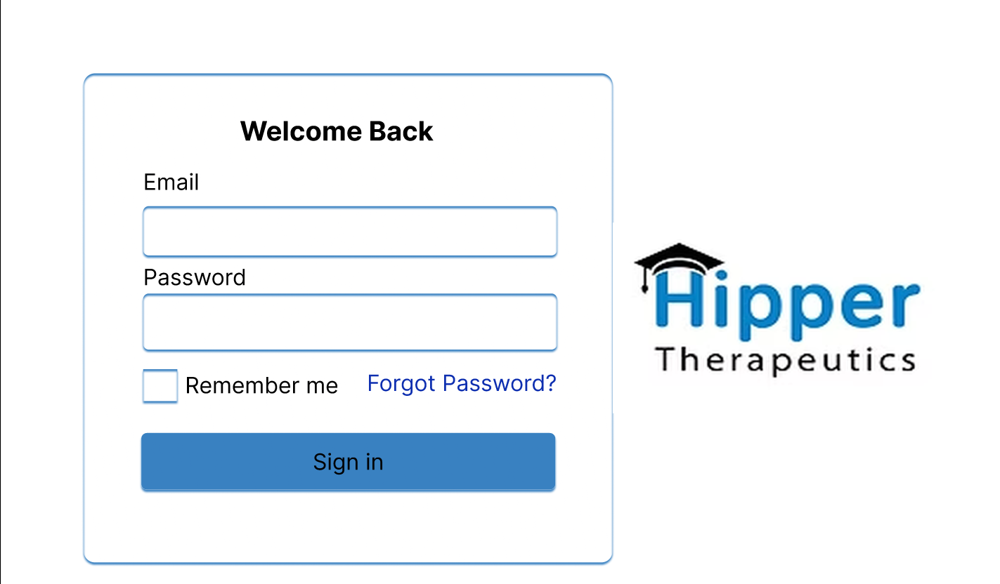

# Figma

## Color Scheme
The chosen color scheme for the app design closely mirrors the colors used on Hipper’s website. This decision was made after discussions with the team, ensuring the app feels like an authentic extension of the Hipper brand. By aligning the app with the website’s color choices, we aimed to create a seamless and legitimate experience that reinforces Hipper's identity.

- The background color: White
- Font color: Black
- The color of the shadow around the boxes: Light blue (color code: 3981C1)

**References**
- The app used for getting the color code from the website is a macOS app: Digital Color Meter.
- Chatgpt was used to figure out how to use the shadows in figma.

## Visual feedback (Hover effect)
To ensure that users testing the Figma prototype are aware of their actions, we have decided to implement a hover effect. When interacting with buttons or elements in the navbar, the user will see a color change upon hovering, providing clear feedback that the element is being used.

This is an image of the normal look of the page.

This is an image of the look of the page with the hover effect.

### Steps to make the hover effect:

1. Create Two States:

- **Normal State:** Design the button or element as it normally looks.
- **Hover State:** Duplicate the normal state and change the color (or add effects like shadow) for when it's hovered over.

2. Set The Hover Interaction:

- Select the **Normal State**.
- Go to the Prototype tab and drag the blue arrow to the **Hover State**.
- Set the trigger to "While Hovering" and the action to "Smart Animate".

3. Preview The Hover Effect:

- Click Present (top-right) to see the effect in action. When you hover, the element should change color.

4. Add Click Interaction:

- If you want the button to navigate, select the **Normal State**, drag the blue arrow to the target frame, and set the trigger to "On Click".

### References
- Chatgpt is used to help figure out the process of making the hover effect for buttons and the navigation bar.
- Also some youtube video's were used to help with understanding how the make the hover effect. (These will be linked below.)

This video is watched at speed 0.25:  [Navigation Hover Effect in one minute using Figma](https://www.youtube.com/watch?v=CnJIfQRur28)

Video on how to create hover effect on button: [Create a Button With a HOVER Functionality in 128 SECONDS (Figma Tutorial)](https://www.youtube.com/watch?v=AHBEpMD2dZ0)

