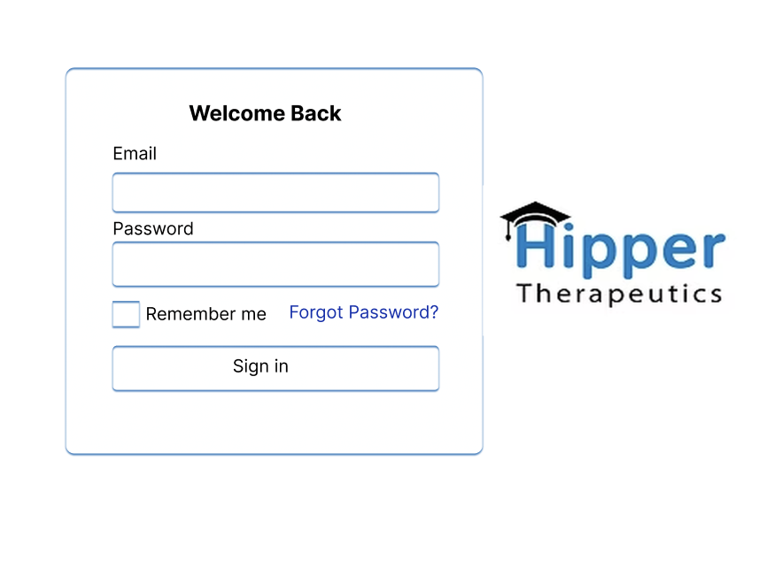
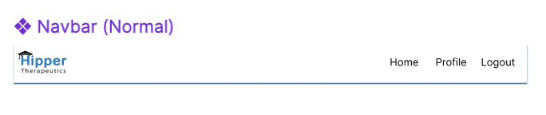

# Figma

## Color Scheme
The chosen color scheme for the app design closely mirrors the colors used on Hipper’s website. This decision was made after discussions with the team, ensuring the app feels like an authentic extension of the Hipper brand. By aligning the app with the website’s color choices, we aimed to create a seamless and legitimate experience that reinforces Hipper's identity.

- The background color: White
- Font color: Black
- The color of the shadow around the boxes: Light blue (color code: 3981C1)

### References
- The app used for getting the color code from the website is a macOS app: Digital Color Meter.
- Chatgpt was used to figure out how to use the shadows in figma.

## Navigation Bar
The navbar that is used in the figma design is made into a component, so the it will be reuseable on every page where it is needed. 

### Elements on the navigation bar:

These are to elements used on the navbar:

- The Hipper logo (left-side)
- Shortcuts to Homepage and Profilepage
- Button to log out.

### Steps to make the component:

1. First you have to design the navbar the way you want it to be.

2. Then you need to group all the elements used in the navbar.

3. After this you can right-click the frame and choose create component or Cmd/Ctrl + Alt + K can be used as a shortcut. Now it will be a reuseable component.

### References
- Chatgpt was used to figure out how to make the reuseable component.