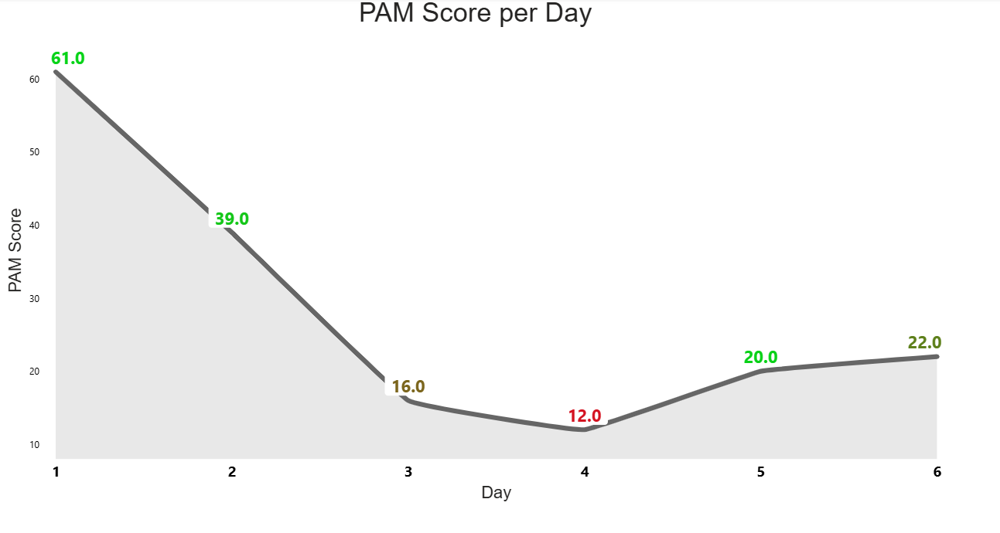
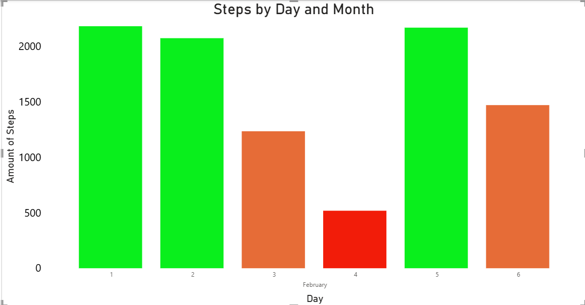

# Graphs for our application

This graph showcases the PAM Score per day, the idea is that if the PAM score is High you will get a green score and if the score is low you will get a RED score, this highlights if you are doing good or bad. 

This graph has the same idea, you can see the amount of steps per day and if the steps are higher than 1800 you get a GREEN score and a Orange for scores between 800 and 1800 and a RED for scores lower than 800. you can then improve based on the scores which are colored for an easy understanding