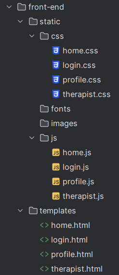

# Web page file template
each page of the frontend exists of a html, css and js file.<br>
all html files are made according to the following template:<br>
````html
<!DOCTYPE html>
<html lang="en">
<head>
  <meta charset="UTF-8" />
  <meta name="viewport" content="width=device-width, initial-scale=1.0" />
  <title>Blank Page</title>
  <link rel="stylesheet" href="../static/css/home.css" />
</head>
<body>

  <!-- Content goes here -->

  <script src="../static/js/home.js"></script>
</body>
</html>

````

# File structures
the file structure is as follows:<br>

the templates folder had all the html files,<br>
the static folder has the css and js files in their folders as well as all the assets like fonts and images.


## Navigation bar
The navigation bar is made in JavaScript in this way the navbar can be injected into every HTML file where it is needed. 

The call upon the navbar in an HTML file you need to include this code:

```HTML
   <link rel="stylesheet" href="../static/css/navbar.css" />

   <div id="navbar"></div>

   <script src="../static/js/navbar.js"></script>

```
These lines of code will dynamically inject the navbar on page load. 

### Navbar design
Before making the code for the navbar there was a design made for the navbar in figma. After talking about it with the team there was decided that we would take most of the design from figma, but there will be some changes to the actual navbar made for the app. The most important page for the patients is the homepage, because of this the navbar won't be used as much, so there was decided that the "Hamburger icon" would be used on the actual design and make a hover effect to show the elements of the navbar.

**Figma design navbar**


**Actual design for app**


### navbar.js
In this file you will find all the html code for the injection of the navbar and function that are used for the functionality of the navbar.

### navbar.css
In this file you will find all the code for the styling of the navbar.

### Responsive 
The links in the navbar will always be hidden under what is called "a hamburger icon" this will stay the same on phone and on desktop. The only thing that will be different is that the text in the center of the navbar will resize when visiting the page on a different device.

### References
- W3Schools is used to figure out how to make the dropdown menu for the navbar.
- Chatgpt is used to help figuring out some errors in the code.

## Profile page
The profile page is used for patient to view there personal information and they are able to change some setting to their own preferences. Before starting to make the code for this page a design on figma was made and with this design the profile page was made. There is some difference in the visual experience between phone and desktop. On the phone the boxes are vertical instead of horizontally placed for a better user experience.

**Figma design Profile page**


### profile.css
In the css file used to style the profile page you will find all the code that is used to style the page