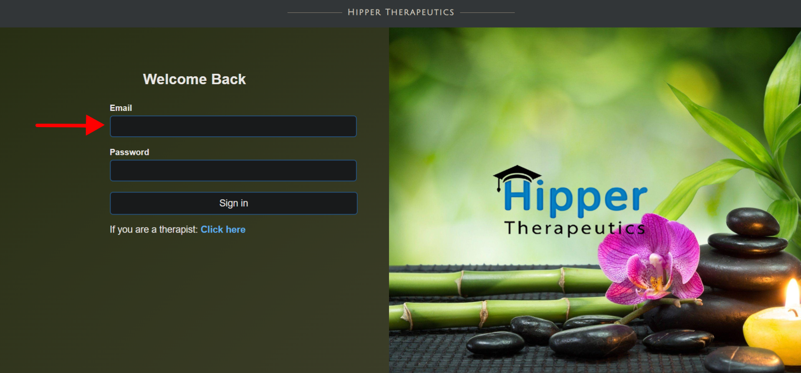
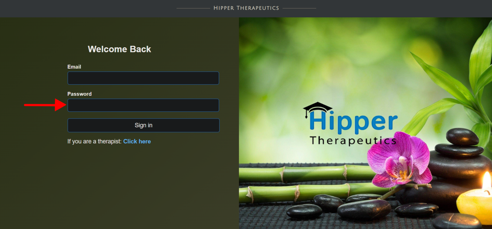
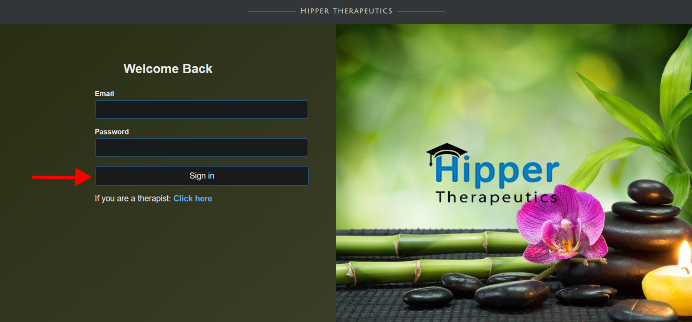
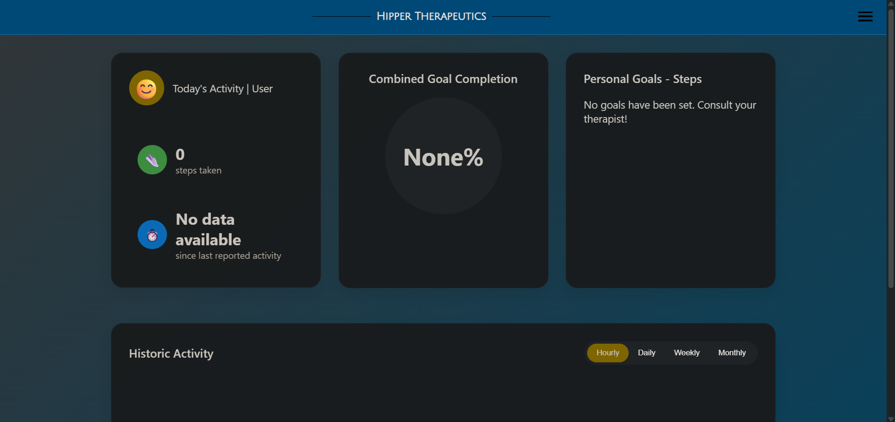
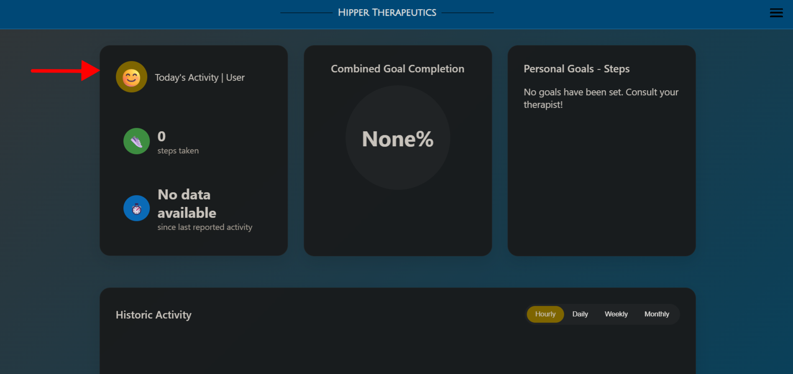
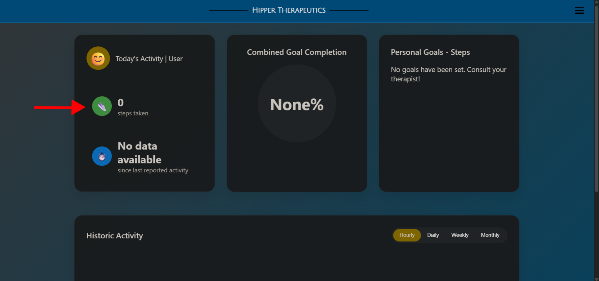
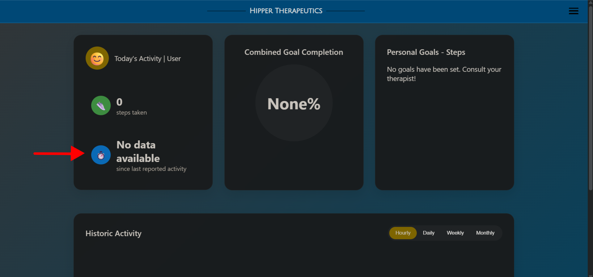
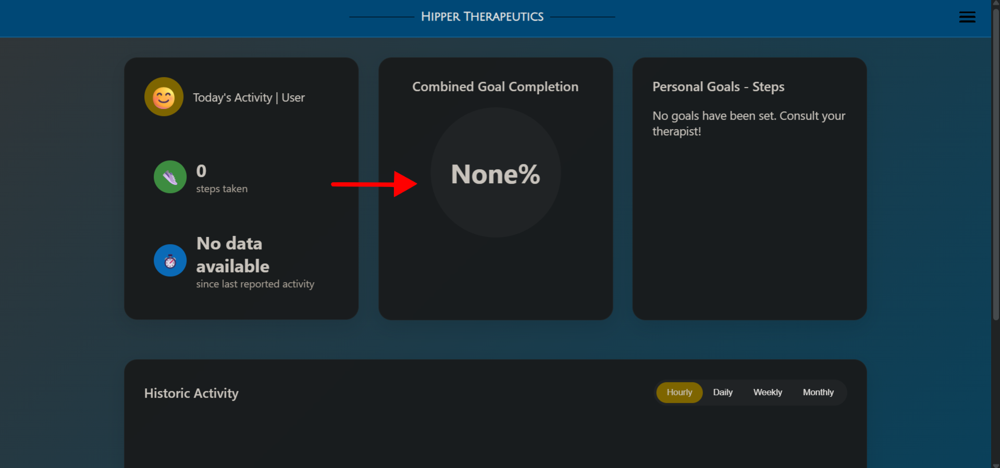
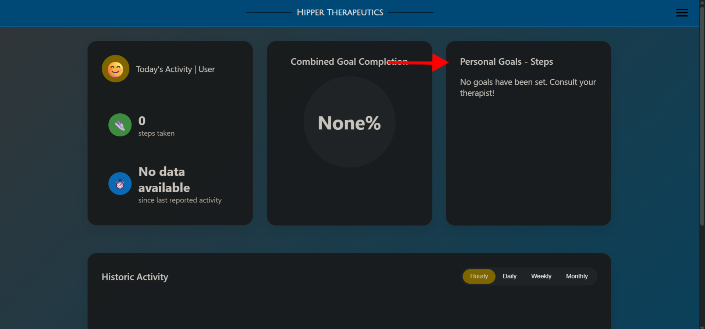
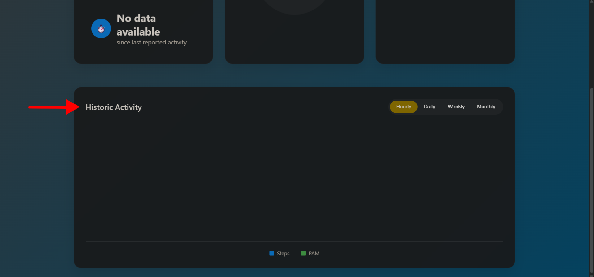

# Patient guide

Welcome to this step-by-step guide to using our site.  

## First step : Login page

### Please enter your email address

To connect to our site, you need to enter the email address you gave to your therapist.

It was your therapist who created your profile, so it's important to use exactly this address.

Once you've entered your email address, we'll look at your password

### Please enter your password

Once you've entered your email address,
please type in the password your therapist has given you.

If you've lost your password, just send a message to your therapist, and they'll be able to send you a new one very easily.

### Click on the Sign in button

Once you have entered your email address and password, click on the Sign in button
If everything is correct, you will be redirected to your personal space

## Second step : Home page

Once you have entered your email address and password, 
and clicked Sign in, you will be taken to the site's home page.

On this page, you can see a number of important pieces of information :

- Activity User

- Steps taken

- The stopwatch icon

- Combined Goal Completion

- Personals Goals - Steps

- Historic Activity

### Activity User

This section gives you a visual overview of your activity for the day.
It lets you see at a glance whether you've been active today, and whether what you're doing is good for your health.

For example, here we see that 0 steps have been taken today, which means that activity has not yet been recorded today.

This little chart is a simple tool to motivate and reassure you : you can track your efforts day by day, without having to search the whole site.

### Steps taken

This shoe-shaped icon shows the number of steps you have taken today.

In this example, we see: 
0 steps means that activity has not yet been recorded today, or that you have not yet walked.

This counter lets you track your efforts day by day

### The stopwatch icon

This section shows you how long ago your last activity was recorded.

Here it says: 
No Data available
The patient guide has been made with a test account but let's take the example that it shows 1 hour and 15 minutes.

This means that the last activity was 1 hour and 15 minutes ago.

The stopwatch icon helps you to see whether your physical activity is being properly monitored.  
If there are a lot of hours like here, it could mean :
- you haven't moved recently,
- or that your device has not yet sent the data.

### Combined Goal Completion

In this section, you will see a large circle with a percentage in the middle.  
This percentage shows you the extent to which you have achieved your personal goals.

For example:

- If you see 80%, that means you've achieved almost everything!
- If you see 30%, you're on your way !

This circle is a simple, visual way of seeing how far you've come.

### Personal Goals - Steps

In this section, you can see the goals you have set with your therapist.

For example:
- Take 3,000 steps every day
- Walk 15,000 steps in a week
- Or another personalised goal

- The name of the goal
- The number of steps already taken and the number to be reached
- A coloured bar that fills in as you progress
- A small light 🔥is displayed if you have succeeded several times in a row ( this is known as a streak )

### Historic Activity

Bar graphs show how far you've walked and how you're progressing.

You can choose what you want to see:
- By day : to see your activity each day of the week
- By week : to see your effort week by week
- By month: to see how you're progressing over several months

Each graph shows :
- The steps you have taken
- A score called PAM 

