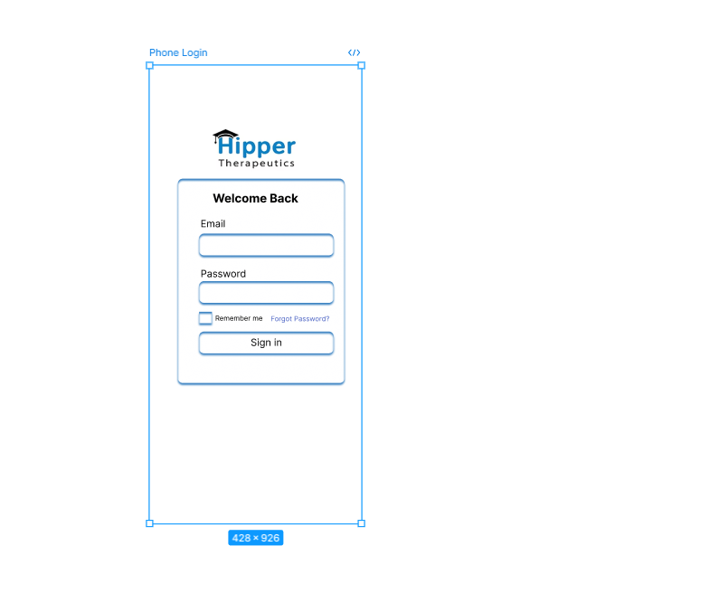
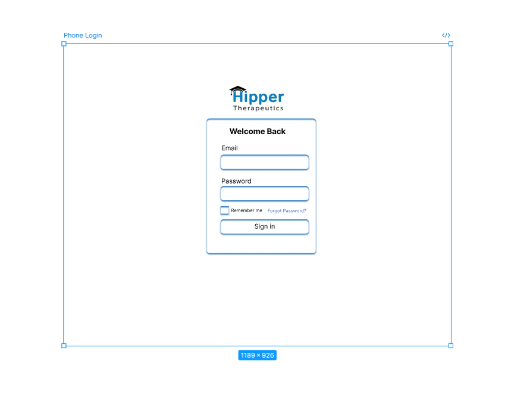
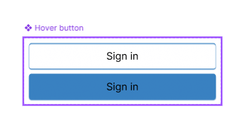
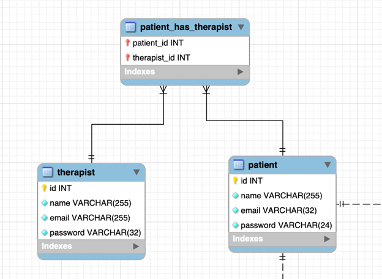
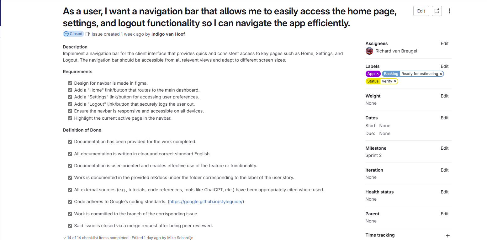
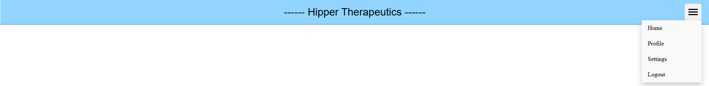

# Learning Journal
This file contains the learning journal with the learning story's of Richard.

## Learning Story 105
As a student, I want to learn how to easily get color codes from colors used on websites, so I can easily replicate them if i need to.

### What I have learned.
Before I started working on the design of the app that will be made there was decided that the app will have the same color theme as the official Hipper website, but to do this I needed the find out the color codes of the colors that are used on the website. To get the color code I spoke with a team member and downloaded an app on my macbook. this app could get the color codes, but there was difficulties with getting it to the website to get the color code, so this app didn't work the way I wanted it to work. After searching for a bit for another app. I found out that there was an build in macOS app on my macbook to get the color codes. After working with this app I found the color codes of the colors used on the official Hipper website and started working on the design.

### References
- First app used is named: Color Picker
- Second app used is named: Digital Color Meter

## Learning Story 108
As a student, I want to learn how to make a hover effect on buttons and the navbar in figma, so when using this prototype it will give a more realistic feeling.

### What I have learned.
To make the prototype in figma more realistic I wanted to learn how to make the hover effect for button and the navbar in figma. To make this happen I first asked chatgpt for instructions on how to do this. This helped a bit, but some things were still unclear without seeing it done, so after asking chatgpt and knowing a bit about it I started searching for video's on youtube. The first one I found was about how to make a hover effect on a button. With this video I was finally able to make the hover effect on the button. The second video I watched was also about the hover effect, but this one was about the navbar. At last after watching these video's I was finally able to get it done.

### Steps to make the hover effect:

1. Create Two States:

- **Normal State:** Design the button or element as it normally looks.
- **Hover State:** Duplicate the normal state and change the color (or add effects like shadow) for when it's hovered over.

2. Set The Hover Interaction:

- Select the **Normal State**.
- Go to the Prototype tab and drag the blue arrow to the **Hover State**.
- Set the trigger to "While Hovering" and the action to "Smart Animate".

3. Preview The Hover Effect:

- Click Present (top-right) to see the effect in action. When you hover, the element should change color.

4. Add Click Interaction:

- If you want the button to navigate, select the **Normal State**, drag the blue arrow to the target frame, and set the trigger to "On Click".

### References
- Chatgpt is used to help figure out the process of making the hover effect for buttons and the navigation bar.
- Also some youtube video's were used to help with understanding how the make the hover effect. (These will be linked below.)

This video is watched at speed 0.25:  [Navigation Hover Effect in one minute using Figma](https://www.youtube.com/watch?v=CnJIfQRur28)

Video on how to create hover effect on button: [Create a Button With a HOVER Functionality in 128 SECONDS (Figma Tutorial)](https://www.youtube.com/watch?v=AHBEpMD2dZ0)

Link to figma: [This is the link to figma](https://www.figma.com/design/uE1Wi3VC106f8T5ExqMtoD/School-Projects?node-id=598-2&p=f&t=kHiMl6c36qMbgXLQ-0)

## Learning Story 186
As a student I want to learn how to work with constraints on figma, so I can make the design responsive.

### What I have learned.
To make the pages on figma responsive, so user can also see you visual of the app when using another device I have to learn how to work with constraints. Contraints control how the elements behave when the frame or screen they are in is resized. This is essential for making a responsive design. To learn how to do this I started learning it using youtube video's and asking some simple questions on chatgpt. After gaining some insights on how to work with constraints I started working with them on the homepage of the design in figma. After working on in for some time I finally got some on the elements to be responsive when resizing the page. The only problem was the images of the graphs on the page. I wanted them to be under eachother when resizing, but no matter what I did I couldn't get it to work. After working with the constraints I learned how to use it on the elements to make them responsive. I think the problem with the graphs was to positioning of them in the normal design. I will look into that further when I will be working on the design again. 




### Steps for work with constraints.

1. Select a Frame as Your Device:

- Add a new frame.
- Choose a preset size (Desktop or Phone etc.).

2. Place Your Elements Inside the Frame:

- Add components to the frame.

3. Set Constraints on Each Element:

- Select an element inside the frame.
- In the **right-hand panel**, find the **Constraints** section.
- Set how the element should behave when the frame resizes.

4. Resize the Frame to Test Responsiveness:

- Drag the frame’s edges or change width in the right panel.
- You’ll see how elements stretch, stick, or reposition.

### References
- Chatgpt was used figuring out how to work with constraints.
- Youtube video's were also used for helping to understand how to work with constraints.

Video on how to make your figma design responsive: [Make Your Web Design Responsive in 10 Minutes | Figma Tutorial](https://www.youtube.com/watch?v=gwiX0oASlEw)

## Learning Story 187
As a student, I want to be able to make reusable components, so I can speed up my workflow and avoid repeating the same design work.

### What I have learned
I want to learn how to create reusable components in Figma to make my design process faster and more consistent. This will help me avoid repeating the same work and make updates more efficient across my designs. For this design in created a reusable navbar and buttons, so I can use them on all the pages needed and easily change all the buttons used when only changing the component itself. To figure out how to make these components I first asked chatgpt for clear instructions. After following all the steps chat gave I made the components needed for the design.



### Steps to make component

1. Design an element.

2. Select the element, right-click, and choose "Create component" or press Cmd/Ctrl + Alt + K.

3. Name the component.

4. Use the component by dragging instances from the Assets panel or copy-pasting it across frames/pages.

5. When you followed all the steps above you should be able to change all copy of this component when you only make a change to the main component.

### References
- Chatgpt was used to figure out the steps on how to make components in figma.

## Learning story 195
As a student, I want to understand and implement a many-to-many relationship in our database design so that I can correctly model real-world interactions between patients and therapists.

### What I have learned
I wanted to learn how to create a junction table to represent a many-to-many relationship, so I started by creating the patient and therapist tables in MySQL Workbench. Then, using the relationship tools from the toolbar, I created a junction table called patient_has_therapist, where I linked the primary keys from both tables and set them as a composite primary key to accurately model the relationship.



### Steps to create junction table (for Many-to-Many Relationship)

1. Open Your EER Diagram.

2. Add the Two Main Tables.

- Create the tables you for the many-to-many relationship.

3. Use the Relationship Tool to Create the Junction Table.

- Select the “Many-to-Many Non-Identifying Relationship” tool from the vertical toolbar (dashed line with crow’s feet at both ends).
- Click first on the first table (e.g., patient), then on the second table (e.g., therapist).
- MySQL Workbench will automatically create a junction table (e.g., patient_has_therapist) and add the necessary foreign key relationships to both original tables.

4. Edit the Junction Table.

- Double-click the auto-created table.

**Verify**

- It has the two columns needed.
- Both are foreign keys referencing their respective tables.
- Both are part of the composite primary key (check the PK boxes).
- Check if both keys are NN (Not Null).

5. Save Your Work.

### References
- One of my team members helped me with understanding how to create the junction table.
- Chatgpt was used to help created the Steps to create junction table.

## Learning Story 210
as a student, I want to learn how to make a user story with a complete vertical slice, so I can get all the requirements for the expert reviews.

### What I have learned
On thursday may 22th I had my first expert review with Mats. I got a lot of feedback on the user story I showed him.

Feedback Mats:

- Het is wat moeilijk werken met deze User Story omdat deze gericht is op het ontwerpproces in Figma waar verder geen eindgebruiker bij komt kijken. Eigenlijk valt dit onder de 'waterfall methodiek'.

- Met Scrum zou je eerder uitkomen dat de user story beschrijft dan de gebruiker een inlogpagina wilt, en dat je vervolgens als onderdeel van deze user story dit formulier gaat ontwerpen in figma, bouwen met html/css/javascript/... en vervolgens testen met gebruiker(s).

- Door de wat onduidelijke user story is de vertical slice niet helemaal lekker gegaan, je bent in sprint 2 hier al beter mee bezig.

- Er is geen code.

- Reviewer heeft nog een feedback gegeven en dat via de merge request gedaan.

- Nog wel de tip gegeven om het gebruik van ChatGPT los te benoemen; niet in de bronnenlijst.

After getting the feedback van Mats I started refining a user story I was working on that week to get the entire vertical slice. At that moment I was working on the navigation bar for the front-end. This user story was already a bit better then the one that I showed during the expert review. The only thing in that user story that was missing was the design part, so in the user story I added another acceptence criteria that's about design of the navbar in figma.



### Steps to make user story with vertical slice

1. Think about what the user needs.

2. Break Down into Vertical Slices.

3. Write the User Story.

4. Define Acceptance Criteria.

5. Ensure Full Stack Coverage.

6. Review with the Team. 

**Chatgpt was used with doing research on the steps to make the user story with the vertical slice**

## Learning Story 212
as a student I want to learn how to make a dropdown menu for the navbar, so I can implement it in this project.

### What I have learned
I wanted to learn how to make a dropdown menu for the elements on the navbar. To do this I started doing research on how to make this possible. A team member told me I could find information for this on W3Schools. When reading through the page I learned that with using simple css code you can make the content hidden by default and it will be displayed when you hover over the dropdown button.

I have detailed my learnings below in the form of a step by step guide on how to make a nav bar:

The css code:

```css
/* The container <div> - needed to position the dropdown content */
.dropdown {
  position: relative;
  display: inline-block;
}

/* Dropdown Content (Hidden by Default) */
.dropdown-content {
  display: none;
  position: absolute;
  background-color: #f9f9f9;
  min-width: 160px;
  box-shadow: 0px 8px 16px 0px rgba(0,0,0,0.2);
  z-index: 1;
}

/* Links inside the dropdown */
.dropdown-content a {
  color: black;
  padding: 12px 16px;
  text-decoration: none;
  display: block;
}

/* Change color of dropdown links on hover */
.dropdown-content a:hover {background-color: #f1f1f1}

/* Show the dropdown menu on hover */
.dropdown:hover .dropdown-content {
  display: block;
}

/* Change the background color of the dropdown button when the dropdown content is shown */
.dropdown:hover .dropbtn {
  background-color: #3e8e41;
}
```



### Steps to make the dropdown menu

1. Make three file for the navbar

- navbar.html
- navbar.css
- navbar.js

2. Write the code for the navbar in the JavaScript file

```js
document.addEventListener("DOMContentLoaded", () => {
  const navbar = `
<nav class="navbar">
  <div class="nav-left"></div>

  <div class="nav-center">------ Hipper Therapeutics ------</div>

  <div class="dropdown nav-right">
    <button class="dropbtn" aria-label="Menu Toggle" id="menu-button">
      <div class="menu-icon">
        <div class="bar"></div>
        <div class="bar"></div>
        <div class="bar"></div>
      </div>
    </button>
    <div class="dropdown-content">
      <a href="/home.html" class="nav-link">Home</a>
      <a href="/profile.html" class="nav-link">Profile</a>
      <a href="/settings.html" class="nav-link">Settings</a>
      <a href="#" class="logoutButton nav-link">Logout</a>
    </div>
  </div>
</nav>

  `;

  // Insert the navbar HTML into the page
  document.getElementById("navbar").innerHTML = navbar;

// Highlight current page in dropdown
// Have to check if this works when we work on local server: extension vscode can't find the paths!
const currentPath = window.location.pathname;
document.querySelectorAll(".nav-link").forEach(link => {
  if (link.getAttribute("href") === currentPath) {
    link.classList.add("active-link");
  }
});

  
  // Add event listener for logout button
  const logoutButton = document.querySelector(".logoutButton");
  if (logoutButton) {
    logoutButton.addEventListener("click", (event) => {
      event.preventDefault(); // Prevent the default link behavior
      logout();
    });
  }

  // Optional: Add toggle behavior if you later implement mobile nav
  const menuButton = document.getElementById("menu-button");
  menuButton?.addEventListener("click", () => {
    const dropdown = document.querySelector(".dropdown-content");
    dropdown.classList.toggle("active"); // You can style `.active` in CSS
  });
});
```

3. Call the navbar in the html file and link the css and js file.

```HTML
   <link rel="stylesheet" href="../static/css/navbar.css" />

   <div id="navbar"></div>

   <script src="../static/js/navbar.js"></script>

```

4. Style the navbar using css.

### References 
- W3Schools is used to understand how to make the dropdown menu. 

[Link to explanation dropdown menu W3Schools](https://www.w3schools.com/css/css_dropdowns.asp)

**Chatgpt was used to do research on dropdown menu and refining the steps to make it**

## Learning Story 222
As a student I want to learn how to work in Jupyter Notebook, so I understand the way to work with it when using it in this project

### What I have learned
Before starting this project, I had never used Jupyter Notebook and didn’t know how it worked. After doing some research, I learned how to navigate and use it effectively. Jupyter Notebook makes it easy to write and run code in separate blocks, which is great for testing and debugging. You can run one cell at a time to check specific parts of your code, or run all cells at once to see the full program in action. It also allows you to add text cells using Markdown to explain your code, document your thought process, or provide important information for other developers. One feature I found especially helpful is the ability to visualize data directly in the notebook using libraries like Matplotlib or Pandas. This makes it much easier to interpret results and spot trends while working with data.

### Steps I used to learn how to work with jupyter notebook

1. Install the exstensions needed.

- Jupyter
- Python

2. Watch a youtube video on how to work with jupyter notebook.

3. At last I started looking into the notebook files made by team members.

4. Start working on your on notebook file.

### References
- I used a youtube video to understand the basics of jupyter notebook. [Link to video](https://www.youtube.com/watch?v=suAkMeWJ1yE)

**Chatgpt was used to help understand some of the features from notebook**

## Learning story 228
as a student, i want to learn how to call a endpoint in a html form, so i can use it in this project.

### What I have learned
While I was writing code for the login pages I first started with fetching the endpoints in javascript files, but when I was talking about it with a team member he said that there was an easier way to call the endpoint. After the conversation I learned that you can just call the endpoint in the html form itself, so after learning this I started implementing it in the project.

**In the code below you can see that the endpoint /admin/login with the method POST is called in the form**
```html
      <form action="/admin/login" method="POST">
        <label for="email">Email</label>
        <input type="email" id="email" name="email" required />
      
        <label for="password">Password</label>
        <input type="password" id="password" name="password" required />
      
        <div class="remember">
          <input type="checkbox" id="remember" name="remember" />
          <label for="remember">Remember me</label>
        </div>
      
        <button type="submit">Sign in</button>
        <a href="#" class="forgot">Forgot Password?</a>
      </form>
```
### References
- A team member showed me that you can call a backend endpoint using an HTML form by setting the action attribute.

## Learning story 249
As a student, I want to learn the basics of data clustering, so I understand the work made by my team members.

### What I have learned
Clustering is a way to group data points that are similar to each other — without needing labels. It’s an unsupervised machine learning technique. This means it only looks at the data and groups points that are similar to each other. A popular algorithm for this is the K-Means algorithm. With this algorithm, you choose a number of clusters (K), and the algorithm tries to group the data so that points in the same cluster are similar to each other, and points in different clusters are as different as possible.

K-Means is widely used because it’s simple, fast, and works well when the data naturally forms well-separated groups. It’s commonly applied in tasks like customer segmentation, grouping documents by topic, or simplifying image data. Although effective, it does require choosing the number of clusters in advance, and it works best when clusters are roughly equal in size and shape.

The actual steps of the K-Means algorithm involve initializing cluster centers, assigning points, updating the centers, and repeating this process until the results stabilize — but more on that later. Everything written here is something I learned, because of never came in contact with clustering data.

### Steps of the K-means algorithm

1. Choose the number of clusters (K):

- Decide how many groups you want the algorithm to find. For example, K = 3 means it will create 3 clusters.

2. Initialize centroids randomly:

- The algorithm randomly places K centroids in the data space. These are the starting "centers" of the clusters.

3. Assign each data point to the nearest centroid:

- For each point in the dataset, calculate the distance to each centroid and assign the point to the closest one. This forms K groups.

4. Recalculate the centroids:

- For each cluster, compute the new centroid by taking the average of all the data points currently assigned to that cluster.

5. Repeat steps 3 and 4:

- Reassign data points based on the updated centroids, then recalculate the centroids again. Repeat this loop until the centroids stop changing significantly — this means the algorithm has converged.

### References
**These youtube video's were used the help understand clustering and K-means algorithm**
- [StatQuest: K-means clustering](https://www.youtube.com/watch?v=4b5d3muPQmA&t=33s)
- [Machine Learning Tutorial Python - 13: K Means Clustering Algorithm](https://www.youtube.com/watch?v=EItlUEPCIzM)

**Chatgpt was used with helping understanding the steps of K-means algorithm and the basics of clustering data**

## Learning story 265
As a student I want to learn have i can see which ports are in use on my mac, so I can fix my problem with running docker.

### What i have learned
When i first wanted to run docker I found out that something was already running on the port that was used for docker, So I started searching what was running on docker, but couldn't find what exactly was running on that port. After a couple of days when I went to school again I asked one of the teachers to help me out, because I couldn't figure out what was running on that port. When looking at it with the teacher I learned that with a simple command you can see all the ports running on your mac, so now I could see what was running on port 5000. When looking up on the internet what it was I found out it was control center on monterey listening to port 5000. At last after i turned of Airplay reciever on my mac like the internet told me I could finally run my docker smoothly.

### Steps used to figure out how to see which ports are already in use

1. Search on the internet for the command to see which port are in use on your mac

2. After you find the command you run the command in your terminal. (sudo lsof -i -n -P | grep TCP)

3. After you see which port you need that is already in use search on google what exactly is running on that port. (You will see this after running the command written above)

4. Turn off whatever is needed to terminate what is running on the port you need.

### References
- To find the command for seeing which ports are in use I used this website [Link to website](https://help.extensis.com/hc/en-us/articles/360010122594-Identifying-ports-in-use-on-macOS-and-Windows)
- To find what was running on that port, so i could terminate it I used this website [Link to website](https://stackoverflow.com/questions/72369320/why-always-something-is-running-at-port-5000-on-my-mac)

## Learning story 272
as a student I want to learn how to refine my user stories, so I can get a higher grade for the review.

### What I have learned
I learned how to clearly define a user story by focusing on the user’s role, objective, and need. I also gained experience writing a complete description that includes design constraints and user experience expectations, such as responsiveness and consistent hamburger menu behavior across devices. Additionally, I learned that for simple UI components like a CSS-based navigation bar, manual testing in a local Docker environment is often sufficient, and that unit testing is only necessary when dynamic logic or complex interactivity is involved.

**Here is the link to the refined user story**
[Refined user story](https://gitlab.fdmci.hva.nl/IoT/2024-2025-semester-2/group-project/duuseedeewuu36/-/issues/163)